# The human auditory system
::: {.notes}
Speaker notes go here.
:::

## What's special about the auditory system?

::: {layout="[60,40]"}

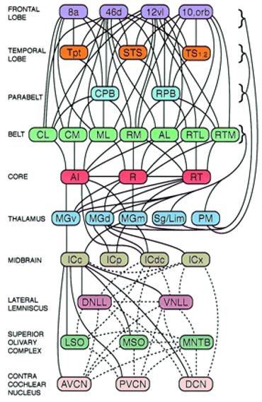{fig-align="center" height='800'  .fragment}

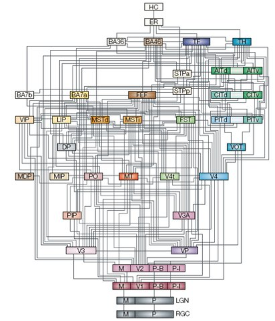{fig-align="center" height='800'  .fragment}

:::

::: {.notes}
So why should we focus on the subcortical parts of the auditory system? I said that those are the harder parts to investigate with MRI, right? Well, there’s actually a lot going on in the brainstem and thalamus, especially in the auditory system.
Two examples from primates show differences between the wiring of the auditory and visual systems. In the auditory system, the first 5 layers of the system are subcortical, and with some cross-talk between them, so some processing can pass through even more structures.
Meanwhile, in the visual system, there’s just one or two stages before hitting primary sensory cortex. Indeed, a lot of processing is already done by the retina itself. With other features extracted later in successively higher levels of visual cortex.
Whereas in the auditory system, there’s some basic frequency and sound level information pulled out by the cochlea, but some other features like location of sound sources are extracted in the brainstem.

BUT THE VAST MAJORITY OF OUR KNOWLEDGE COMES FROM ANIMAL STUDIES
:::

## The human subcortical auditory system

:::: {.columns}

::: {.column}
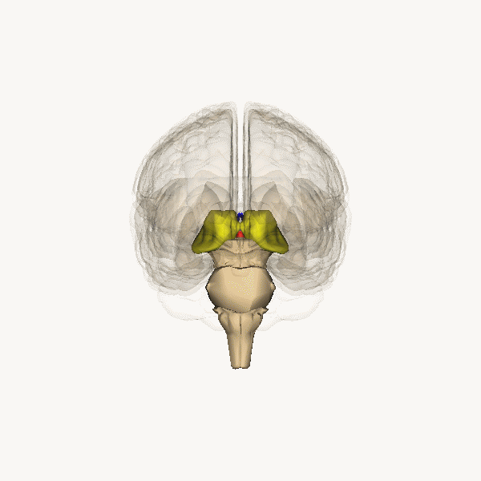{fig-align="center" height=800 .fragment}
:::

::: {.column}
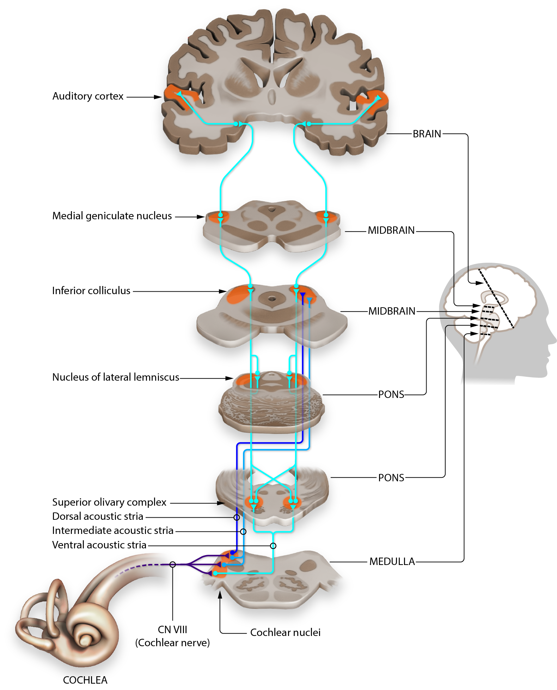{fig-align="center" height=800 .fragment}
:::

::::

::: {.notes}
Across human behaviors, studying the brainstem is challenging.
- In vivo MRI limited by:
 - high resolution needed for small structures
 - decreased signal as voxels get smaller
 - decreased signal in brainstem
- Limited spatial information from EEG, MEG
- Some human histology studies (nuclei)
- Tracer studies (connections) only in animal models
:::

## Imaging the human subcortical auditory system {.smaller}

::: {.incremental}

::: {layout="[[1,1,1]]"  layout-valign="bottom"}
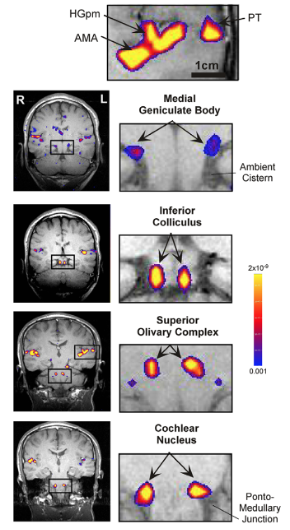{.fragment}

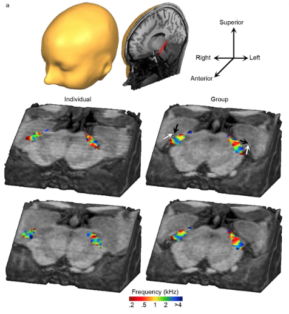{.fragment}

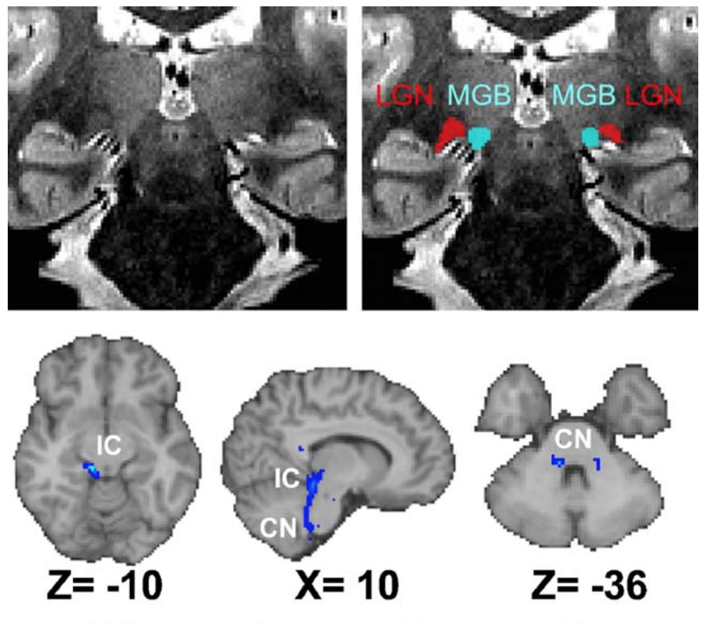{.fragment}
:::

::: 

::: {.notes}
Speaker notes go here.
:::

## My contributions

::: {.incremental}

- Mapping the human subcortical auditory system
  - Anatomy
  - Function
  - Connectivity (structural and functional)
- Behavior of the human auditory system
  - Auditory–motor interactions across the auditory pathway
  - Auditory categorization in the human brain
  - Developing speech-in-noise processes

::: 

::: aside
This work is actively supported by K01-DC019421 and R21-DC022906.
:::

::: {.notes}
Speaker notes go here.
:::

# Mapping the human subcortical auditory system

::: {.notes}
Speaker notes go here.
:::

## Brainstem anatomy: Gold standard vs. standard practice

::: {layout-ncol=2}
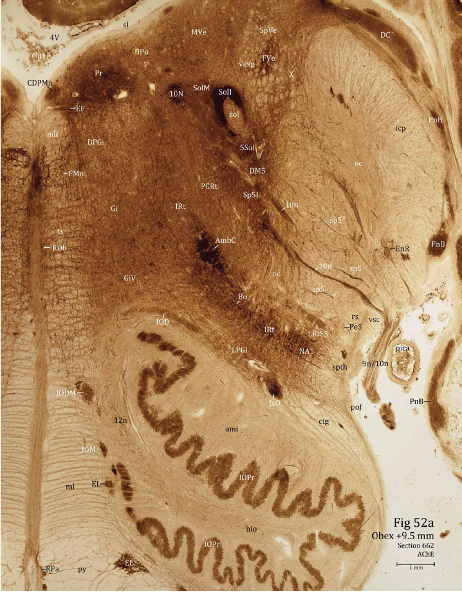{.fragment}

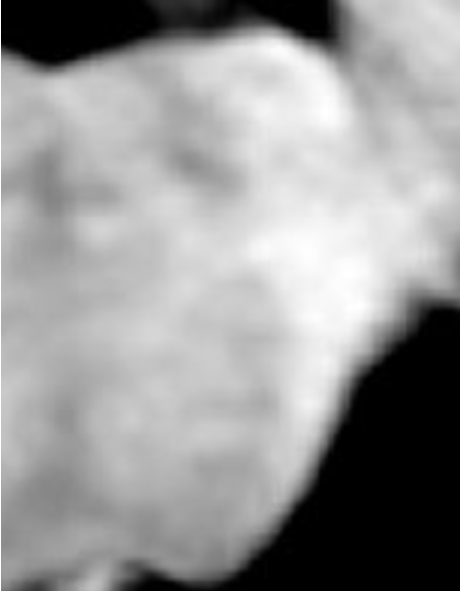{.fragment}

:::

## *Where* are the auditory structures in humans?

::: {.incremental}

- Human histology: BigBrain (20 µm)
- Post mortem brainstem MRI (small-bore 7 Tesla Bruker MRI)
  - T2*-weighted anatomy (50 µm)
  - Diffusion-weighted MRI (200 µm)
- 7 Tesla functional MRI (Siemens Magnetom; 1.1 mm voxels)
  - 168 natural sounds (1 s each); sound > baseline contrast
  - Collected over 2 sessions

::: 

## Human histology mapping

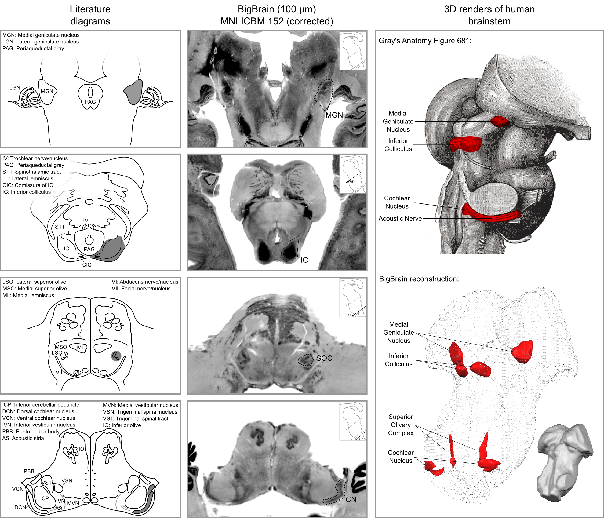{fig-align="center" height=800}

{.absolute bottom=10 right=10 width="200" height="200"}

::: aside
Sitek* and Gulban* et al. (2019 *eLife*)
:::

::: {.notes}
Speaker notes go here.
:::

## Post mortem MRI mapping

::: {layout-ncol=2}
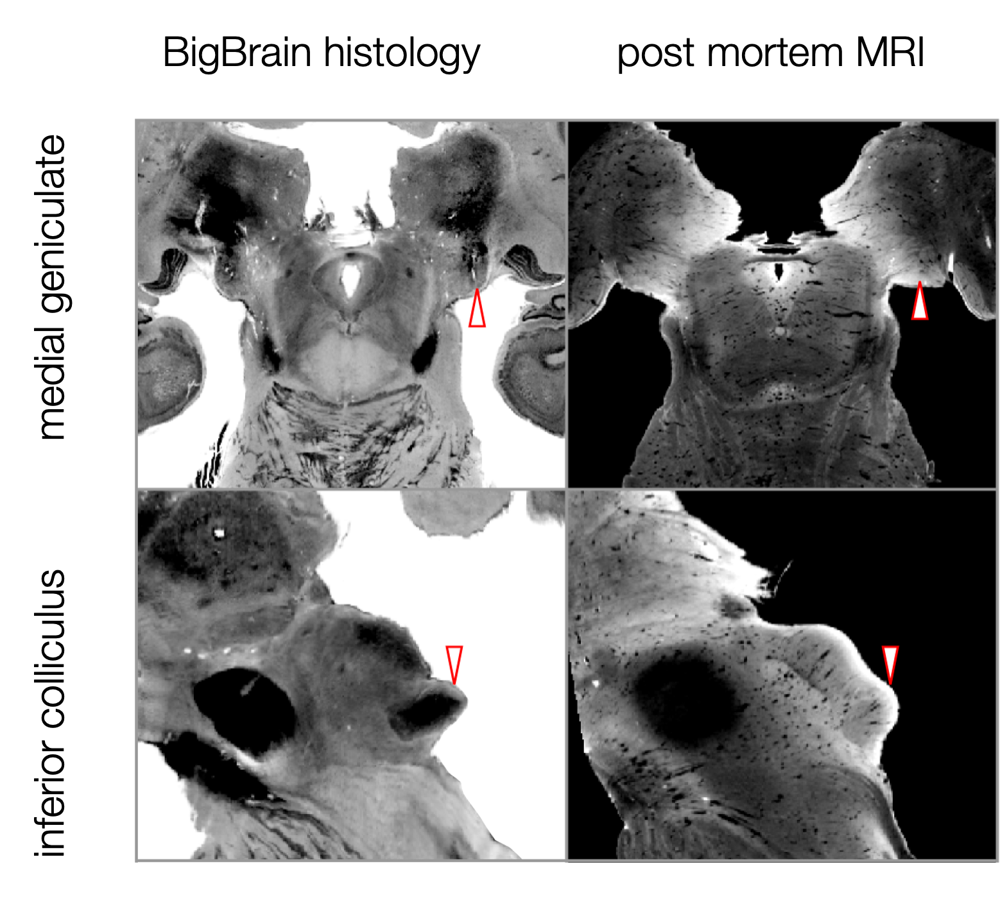{height="420" .fragment}

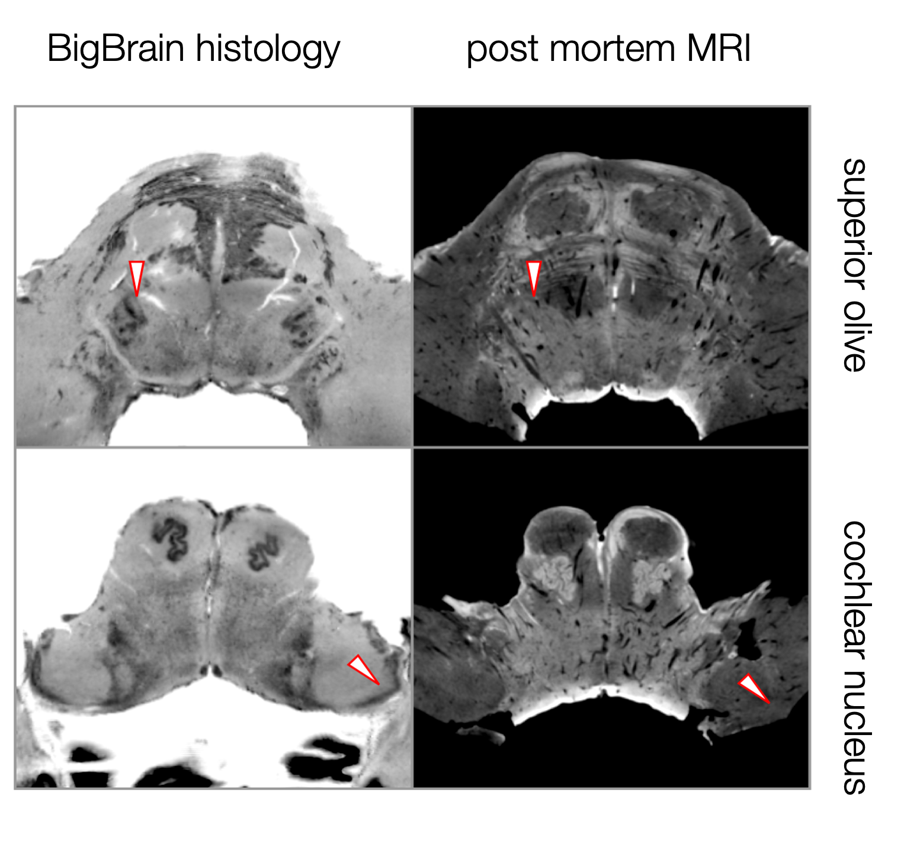{height="420" .fragment}

:::

{.absolute bottom=10 right=10 width="200" height="200"}

::: aside
Sitek* and Gulban* et al. (2019 *eLife*)
:::

::: {.notes}
Speaker notes go here.
:::

## In vivo functional MRI mapping
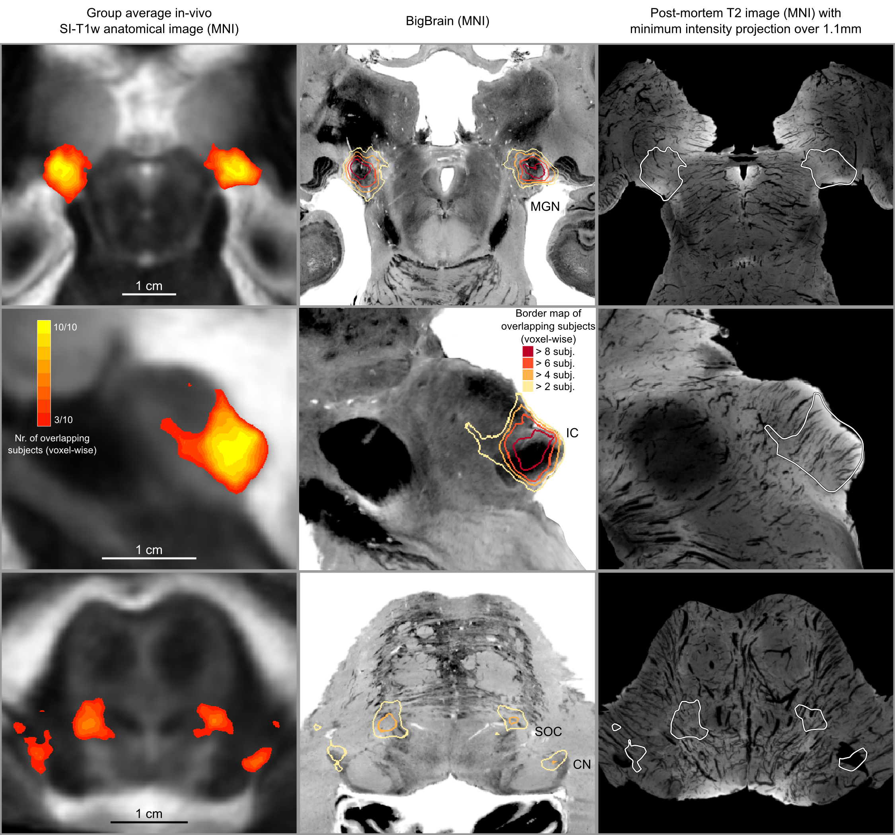{fig-align="center" height=800}

{.absolute bottom=10 right=10 width="200" height="200"}

::: aside
Sitek* and Gulban* et al. (2019 *eLife*)
:::

::: {.notes}
Speaker notes go here.
:::

## *Where* are the auditory structures: Public atlases from three sources

::: {.r-stack}


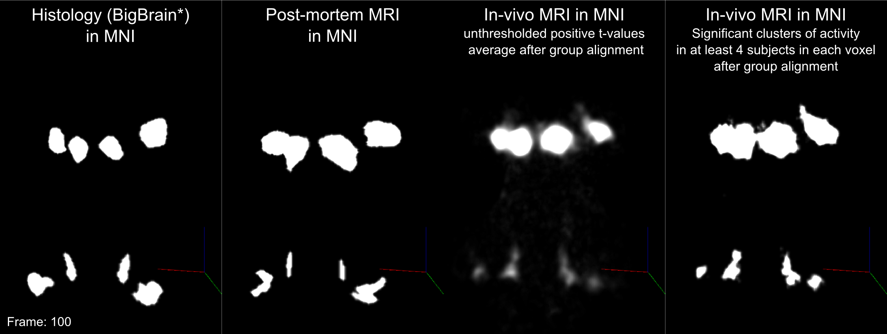{.fragment fig-align="center"}
:::

{.absolute bottom=10 right=10 width="200" height="200"}

::: aside
Sitek* and Gulban* et al. (2019 *eLife*)
:::

::: {.notes}
Speaker notes go here.
:::

# Connectivity of the human subcortical auditory system

::: {.notes}
Speaker notes go here.
:::

## Anatomical connectivity mapping with diffusion-weighted MRI {.smaller}

::: {layout="[50,50]"  layout-valign="center"}

::: {.incremental}
- Look at how MRI signal varies across directions of molecular motion 
- Since white matter constrains the motion of water molecules, we can infer orientation of white matter in each voxel
- Then traverse voxel-to-voxel to estimate pathways (*tractography*)
:::

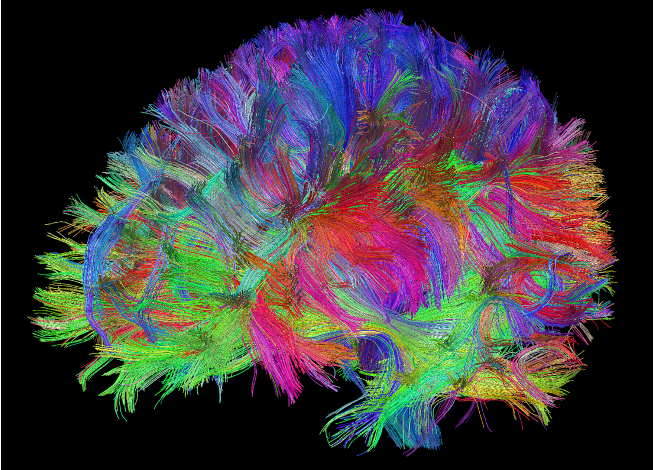{}

:::

::: {.notes}
Speaker notes go here.
:::

## How are the auditory structures connected **anatomically**?

::: {.incremental}

::: {layout-ncol=2}

::: {.r-stack}


{fig-align="center" height=800 .fragment} 
:::

:::
:::
{.absolute bottom=10 right=10 width="200" height="200"}

::: aside
Sitek* and Gulban* et al. (2019 *eLife*); 
Sitek et al. (2022 *Frontiers Neuro*)
:::

::: {.notes}
Speaker notes go here.
:::

## How are the auditory structures connected **anatomically**?

::: {layout-ncol=2}

{fig-align="center" height=800} 

::: {.r-stack}


{fig-align="center" height=800 .fragment}
:::
:::
{.absolute bottom=10 right=10 width="200" height="200"}

::: aside
Sitek* and Gulban* et al. (2019 *eLife*); 
Sitek et al. (2022 *Frontiers Neuro*)
:::

::: {.notes}
Speaker notes go here.
:::

## How are the auditory structures connected **functionally**?{.smaller}

::: {layout="[50,50]"}

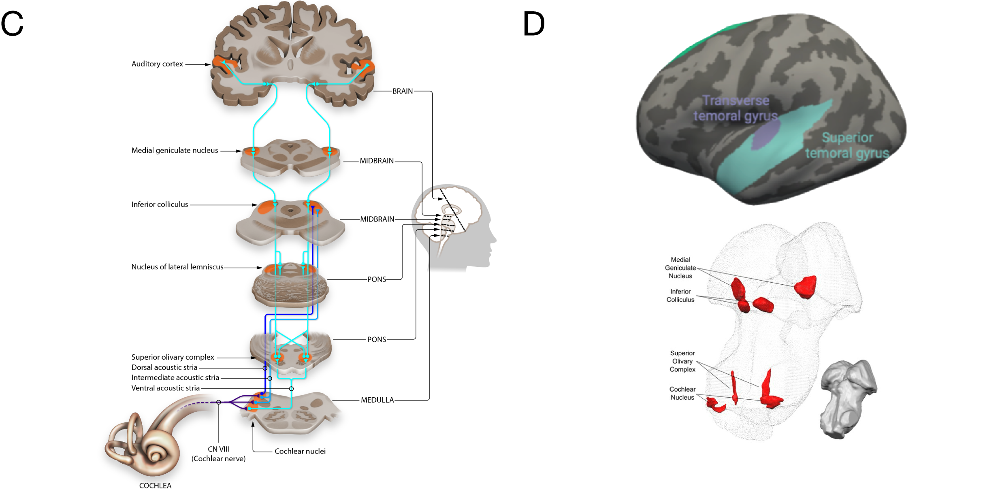{data-id="fig1"}

::: {.incremental}
- 7T Human Connectome Project (106 participants)
- 4 runs of resting state fMRI
  - 1 s x 900 TRs
  - 2 Anterior–Posterior runs, 2 Posterior–Anterior runs
- Partial correlations via novel autoregressive matrix-Gaussian copula graphical model
:::

:::

{.absolute bottom=10 right=10 width="200" height="200"}

::: aside
Chandra* and Sitek* et al. (2024 *Imaging Neuro*)
:::

::: {.notes}
Speaker notes go here.
:::

## How are the auditory structures connected **functionally**?

::: {layout="[50,25,25]"   layout-valign="center"}
{data-id="fig1"}

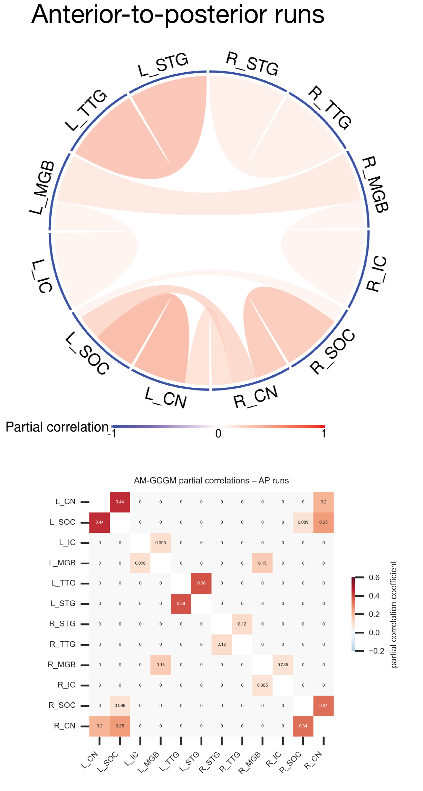{.fragment}

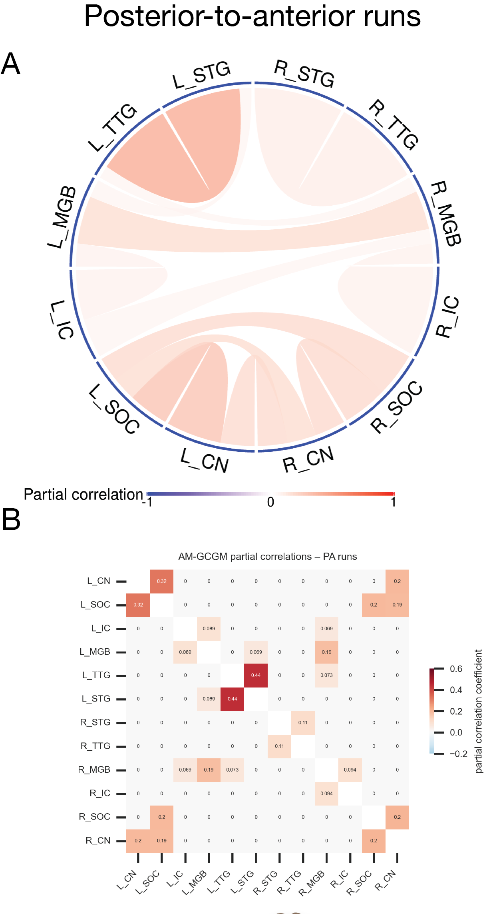{.fragment}
:::

{.absolute bottom=10 right=10 width="200" height="200"}

::: aside
Chandra* and Sitek* et al. (2024 *Imaging Neuro*)
:::

::: {.notes}
Speaker notes go here.
:::

## How is the brainstem supplied oxygen? {.nostretch}

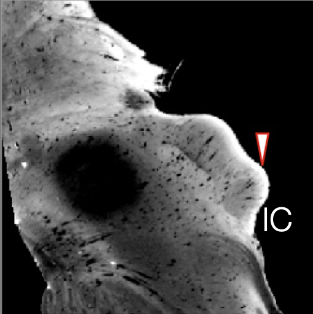{.absolute top=10 right=10 width="300" height="300"}

::: {layout="[40,20,40]"  layout-valign="center" .fragment }
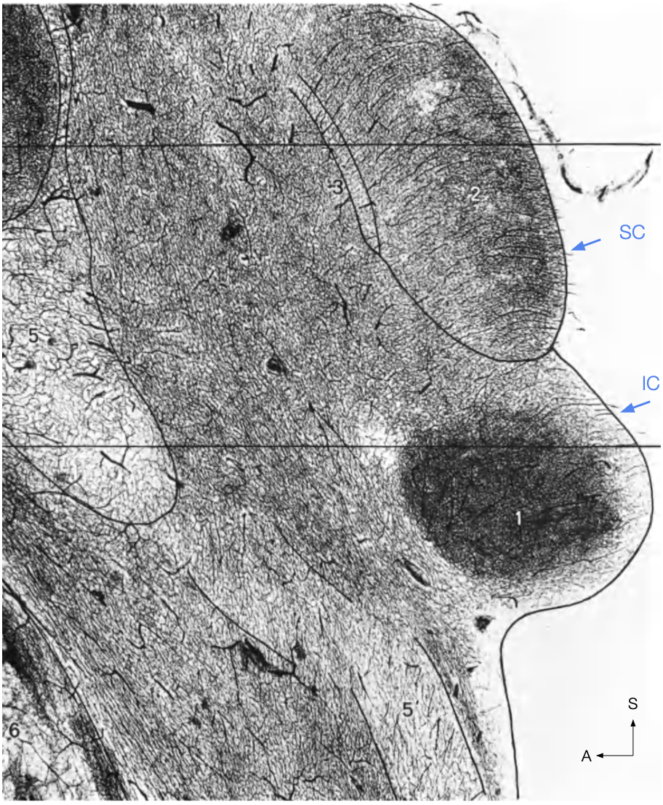{height="750" .fragment}

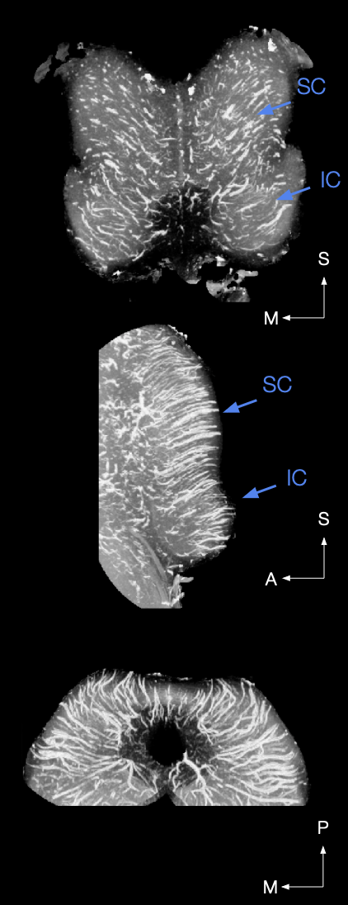{height="750" .fragment}

:::

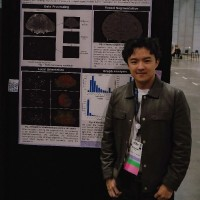{.absolute bottom=10 right=10 width="200" height="200"}

::: aside
OHBM 2023, 2024, 2025
:::

::: {.notes}
Speaker notes go here.
:::

## How is the brainstem supplied oxygen? {.nostretch}

{.absolute top=10 right=10 width="300" height="300"}

::: {layout="[40,20,40]"  layout-valign="center" }
{height="750"}

{height="750"}


:::

{.absolute bottom=10 right=10 width="200" height="200"}

::: aside
OHBM 2023, 2024, 2025
:::

::: {.notes}
Speaker notes go here.
:::

## But what if we don't have a 7T MRI?

### Multi-echo fMRI improves brainstem sensitivity at 3T

{.absolute bottom=10 right=10 width="200" height="200"}

:::: {.columns}

::: {.column .fragment}
- Multi-echo fMRI acquisition
  - Echo times = 13.40/39.5/65.6 ms
  - Repetition time = 2.2 s
  - Multiband factor = 2
  - Voxel size = 1.731×1.731×4 mm^3
  - Whole-brain coverage (44 slices, FOV=180mm)
- Multi-echo optimal combination + ICA noise removal (`tedana`)
:::

::: {.column  .fragment}
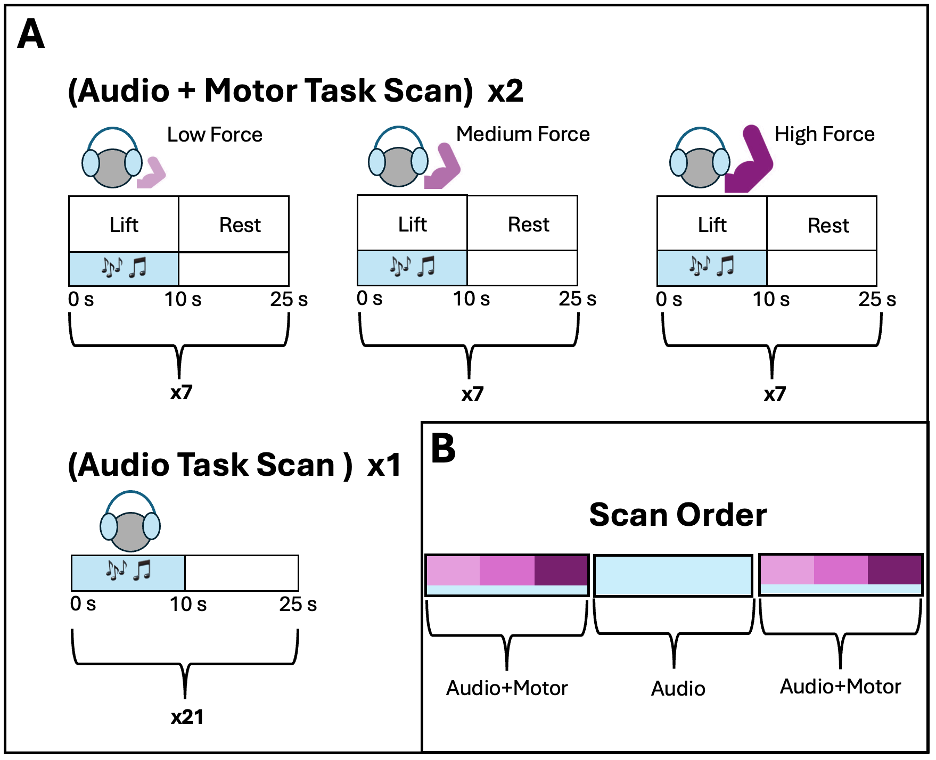{fig-align="center" height=600}
:::

::::

::: aside
Medina et al. (in prep.; ISMRM 2025)
:::

::: {.notes}
So far, each of the results I've shown have used 7 Tesla MRI. 
These are becoming more prevalent, especially now that the Siemens Terra is approved by the FDA. 
But they're still much less common than 3 Tesla MRIs. 
Fortunately, data acquisition protocols have improved sensitivty even at 3T, 
so that we can reliably identify auditory midbrain and thalamus.
:::

## But what if we don't have a 7T MRI?

### Multi-echo fMRI improves brainstem sensitivity at 3T

{.absolute bottom=10 right=10 width="200" height="200"}

:::: {.columns}

::: {.column .fragment}
High sensitivity across individuals

::: {.r-stack}
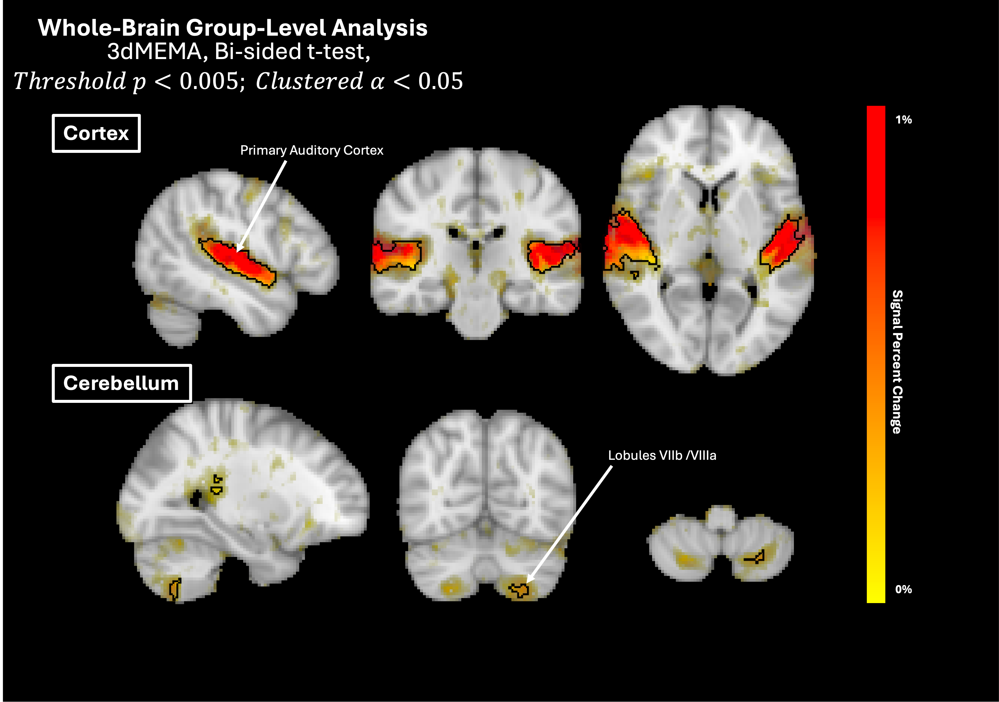{.fragment fig-align="center" height=600}

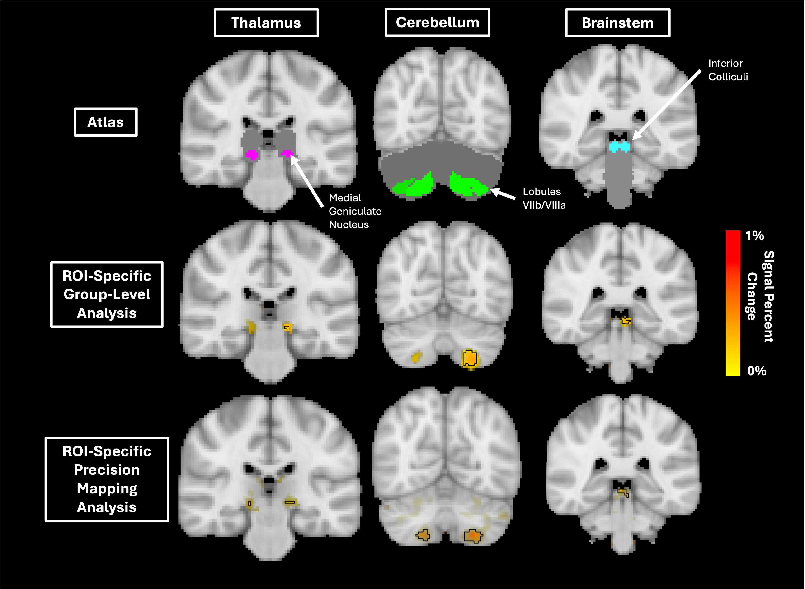{.fragment fig-align="center" height=700}
:::

:::

::: {.column .fragment}
High reliability within individuals 

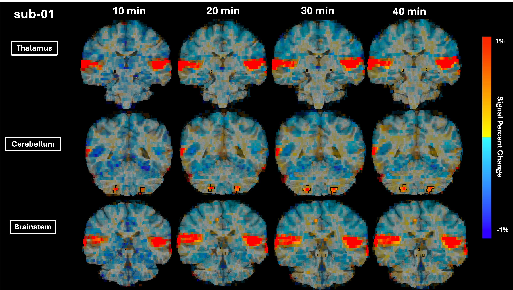{fig-align="center" height=600}

:::

::::

::: aside
Medina et al. (in prep.; ISMRM 2025)
:::

::: {.notes}
So far, each of the results I've shown have used 7 Tesla MRI. 
These are becoming more prevalent, especially now that the Siemens Terra is approved by the FDA. 
But they're still much less common than 3 Tesla MRIs. 
Fortunately, data acquisition protocols have improved sensitivty even at 3T, 
so that we can reliably identify auditory midbrain and thalamus.
:::

# Auditory–motor interactions across the auditory pathway

::: {.notes}
So far I've focused on the basics: where are human auditory structures, and how are they connected. 
Ultimately, we want to *use* these approaches to learn more about the *function* of the human brain 
*in action*. 
:::

## Human speech and auditory feedback processing

:::: {.columns}

::: {.column .fragment}
#### Suppressed auditory cortical response to own voice during speaking vs. playback^[Houde & Jordan (2002)]

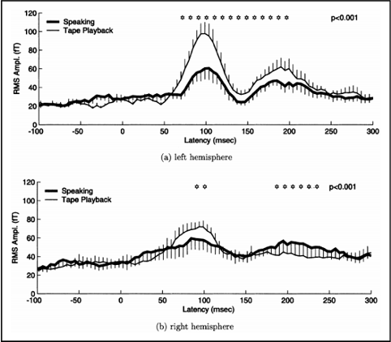{fig-align="center" height="500" .fragment}

:::

::: {.column .fragment}
#### Processing variability in our own speech^[**Sitek** et al. (2013)]

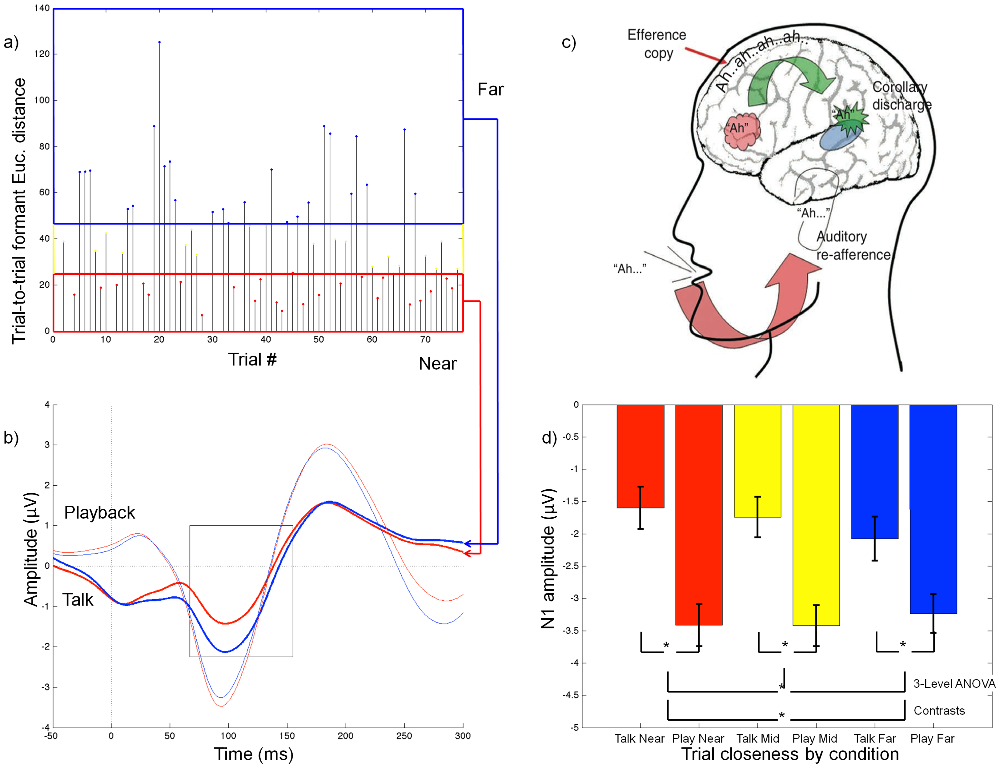{fig-align="center" height="500" .fragment}

#### *Increased* BOLD in STG for self-generated tones^[Reznik et al. (2015)]

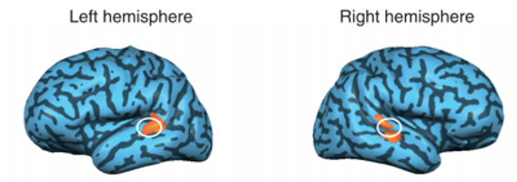{fig-align="center" .fragment}
:::
::::

::: {.notes}
Houde; Niziolek; Chang; 
:::

## Cortical feedback processing in animals

:::: {.columns}

::: {.column .fragment}
#### Overall suppression (but some excitation) in marmoset auditory cortex^[Eliades & Wang (2005)]

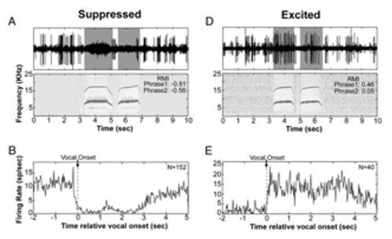{height="500" fig-align="center"}
:::

::: {.column .fragment}
#### Mouse ACtx excitatory neurons inhibited, inhibitory neurons excited during movement^[Schneider et al. (2014)]

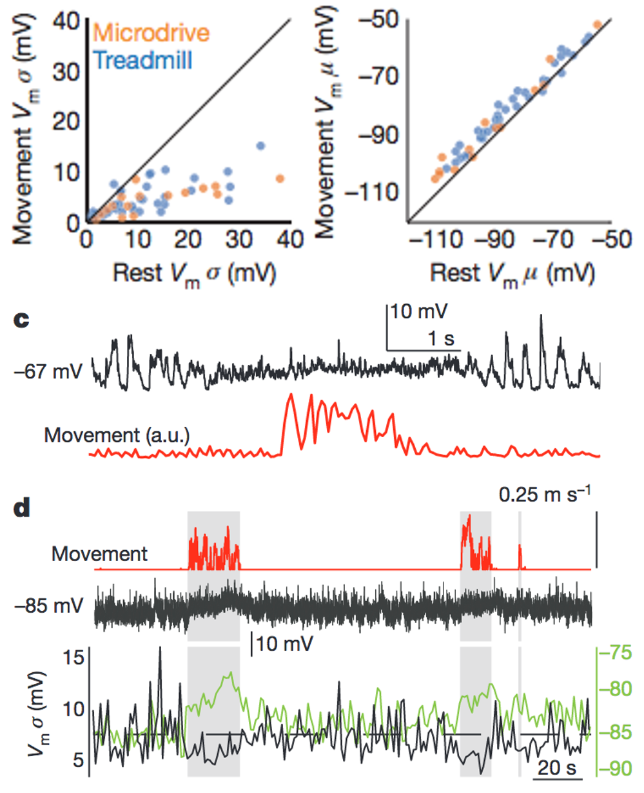{height="800" fig-align="center"}
:::

::::

::: {.notes}
Speaker notes go here.
:::

## *Sub*cortical feedback processing in animals

:::: {.columns}

::: {.column .fragment}
#### Top-down control

- Cortical modulation accounts for some but not all of the auditory attenuation to self-generated sounds (mouse^[Schneider, Nelson, & Mooney 2014])
- Vocal pathways modulate efferent neurons to the inner ear and lateral line (fish^[Weeg et al. 2005])
- Frequency-specific selective corticofugal modulation of individual olivocochlear efferent fibers (bat^[Xiao & Suga 2002])

:::

::: {.column .fragment}
#### Mouse licking in DCN^[Singla et al. (2017)]
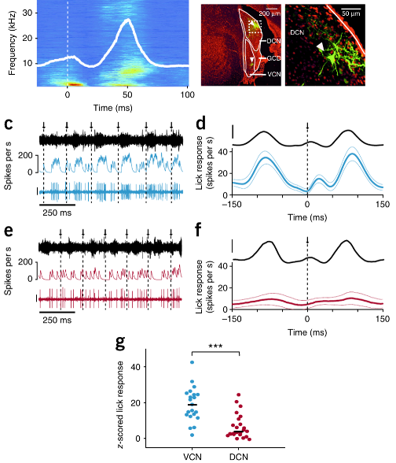{height="800" fig-align="center"}
:::

::::

::: {.notes}
Speaker notes go here.
:::

## *Where* are motor signals integrated? Subcortically? 

{.absolute bottom=10 right=10 width="200" height="200"}

#### The scalp-recorded frequency-following response (FFR) shows the fidelity of incoming sound encoding
:::: {.columns}

::: {.column .fragment}
- If integration is subcortical, would expect to see FFR differences between self-generated vs. passive sound
- Collected FFR from 33 normal-hearing adults in *active* (button-press + sound) and *passive* (sound only) conditions
:::

::: {.column .fragment}

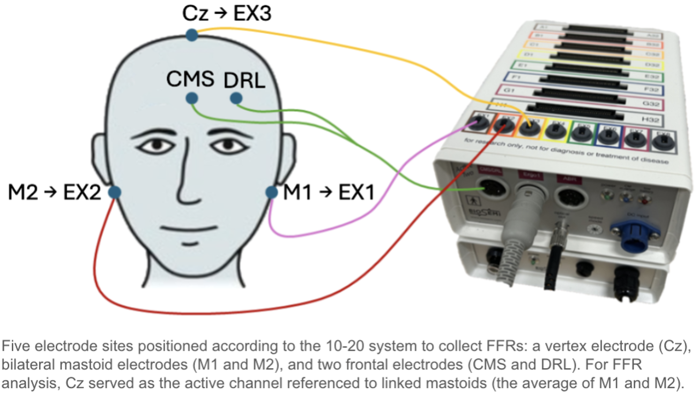{fig-align="center" height="300"}

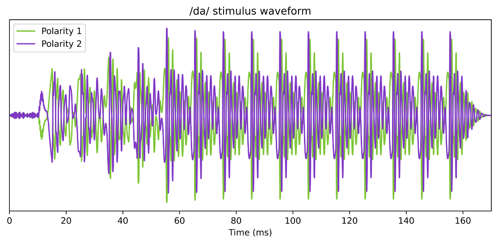{fig-align="center" height="300"}

:::
::::

::: aside
Butler, ..., Sitek (in prep; SNL 2025)
:::

::: {.notes}
If integration is subcortical, would expect to see FFR differences between self-generated vs. passive sound
:::

## *Where* are motor signals integrated? Subcortically? 

{.absolute bottom=10 right=10 width="200" height="200"}

### EEG waveforms

:::: {.columns}

::: {.column .fragment}
#### Brainstem frequency-following response
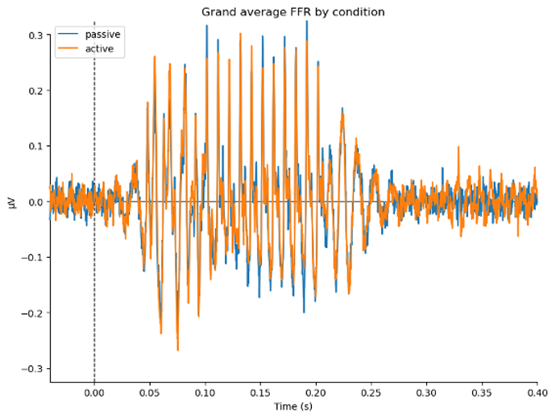
:::

::: {.column .fragment}
#### Cortical evoked response
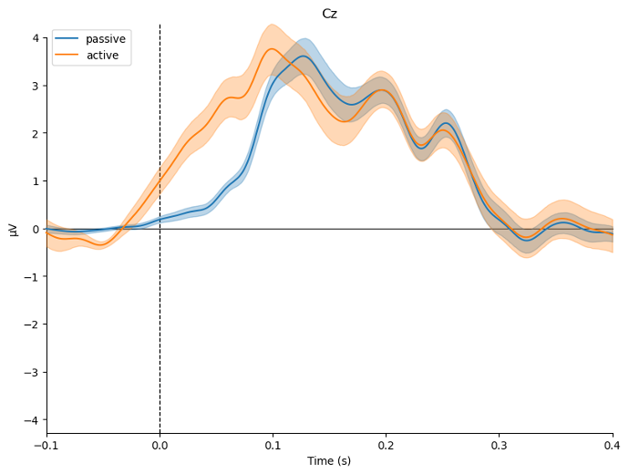

:::
::::

::: aside
Butler, ..., Sitek (in prep; SNL 2025)
:::

::: {.notes}
If integration is subcortical, would expect to see FFR differences between self-generated vs. passive sound
:::

## *Where* are motor signals integrated? Subcortically? 

{.absolute bottom=10 right=10 width="200" height="200"}

### EEG spectrograms

:::: {.columns}

::: {.column .fragment}
#### Brainstem frequency-following response
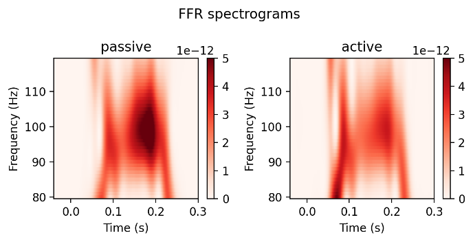
:::

::: {.column .fragment}
#### Cortical evoked response
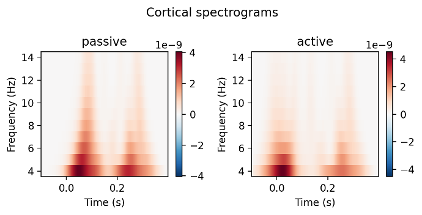

:::
::::

::: aside
Butler, ..., Sitek (in prep; SNL 2025)
:::

::: {.notes}
If integration is subcortical, would expect to see FFR differences between self-generated vs. passive sound
:::

## *Where* are motor signals integrated? Subcortically?

{.absolute bottom=10 right=10 width="200" height="200"}

#### Brainstem frequency-following response (FFR) shows the same sound encoding when a sound is self-generated or passively presented

::: {.incremental}
- If integration is subcortical, would expect to see brainstem FFR differences between self-generated vs. passive sound
- No brainstem FFR differences, despite cortical evoked response differences
- **Motor signals unlikely to attenuate earliest central auditory signals**
- *Next steps*: Source localization of FFR generators (ECR R21 project)
:::

::: aside
Butler, ..., Sitek (in prep; SNL 2025)
:::

::: {.notes}
If integration is subcortical, would expect to see FFR differences between self-generated vs. passive sound
:::

## *Where* are motor signals integrated in auditory cortex?

::: {.incremental}
- Previous literature implicates auditory cortex as a hub for auditory–motor integration
- But fMRI has shown *increased* BOLD to self-generated sounds, vs. *suppressed* M/EEG responses^[Reznik et al. (2015)]
- Are different laminar responses the explanation? 
- We can look at intra-cortical circuits with ultra-high field **7T fMRI**
  - Depth-dependent BOLD fMRI acquisition
  - 7 participants: 1 mm isotropic voxels, TE = 22.8 ms, MB = 6
  - 1 replication: 0.8 mm isotropic voxels, TE = 21.4, MB = 4
  - Cortical depth profile differences during self-generated vs. passive sound
:::

::: aside
Sitek et al. (in prep; OHBM 2025)
:::

::: {.notes}
Speaker notes go here.
:::

## Greater self-generated vs. passive fMRI responses in a single participant across replications

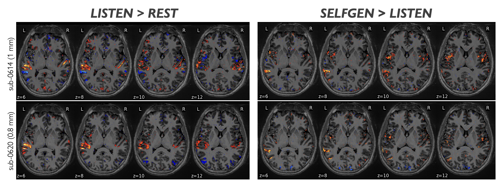

::: aside
Sitek et al. (in prep; OHBM 2025)
:::

::: {.notes}
Speaker notes go here.
:::

## Stronger self-generated (vs. passive) sound responses in superficial auditory cortex

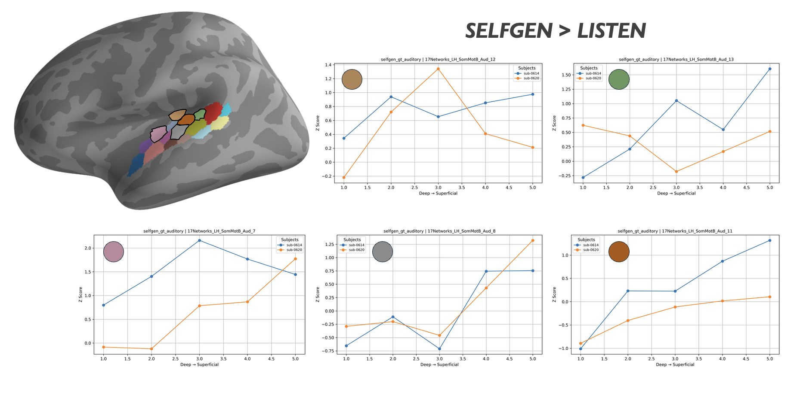

::: aside
Sitek et al. (in prep; OHBM 2025)
:::

::: {.notes}
Speaker notes go here.
:::

## Evidence for layer-specific motor-related activation in human auditory cortex

:::: {.columns}

::: {.column width="50%" .fragment}
::: {.incremental}
- Increased BOLD in self-generated vs. active condition
- Higher increases at superficial cortical depths, suggesting increased *corticocortical* feedback
- Helps explain increased BOLD in previous studies
- Same cortical depth effects in two acquisitions in the same participant
:::
:::

::: {.column width="50%"}
{height="400"}
{height="400"}
:::
::::

::: aside
Sitek et al. (in prep; OHBM 2025)
:::

::: {.notes}
Speaker notes go here.
:::

# Auditory categorization in the human brain

::: {.notes}
Speaker notes go here.
:::

## Pathways for auditory learning and categorization

::: {.incremental}

::: {layout="[30,70]"}

![Macaque auditory-striatal connections^[Yeterian & Pandya (1997)]](images/YeterianPandya1997.png){fig-align="center" height="600" .fragment}

![Human auditory–striatal connections^[Sitek et al. (2022 preprint); Sitek et al. (submitted)]](images/Sitek_corticostriatal_endpoints.png){fig-align="center" height="600" .fragment}

:::
:::

::: aside
:::

::: {.notes}
Speaker notes go here.
:::

## How do humans learn new sensory categories?

::: {.incremental}
- 7 Tesla high resolution functional MRI (1.5 mm isotropic vixels)
- 12 non-Mandarin-speaking participants (18–30 years old)
- Auditory category learning task with Mandarin tone stimuli^[Yi et al., 2016; Reetzke et al., 2018; Feng et al., 2019; …]
:::

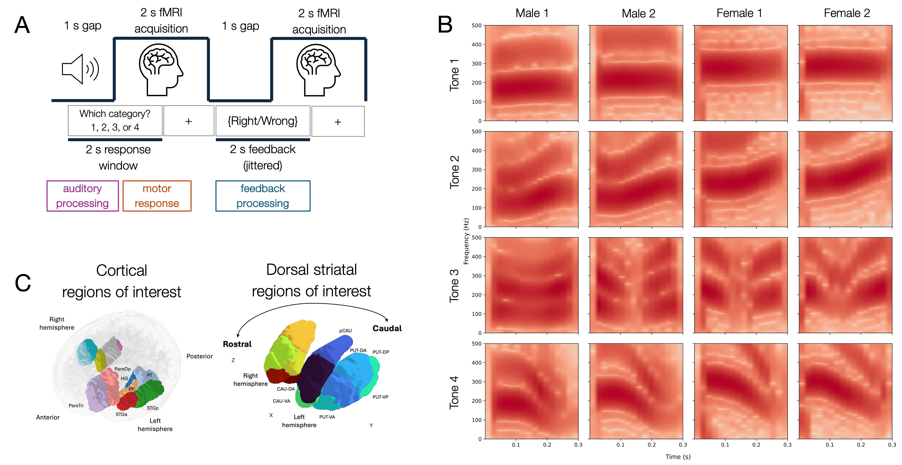{fig-align="center" height="600" .fragment}

::: aside
Sitek et al. (submitted)
:::
::: {.notes}
Speaker notes go here.
:::

## Successful learning of new auditory categories in MRI

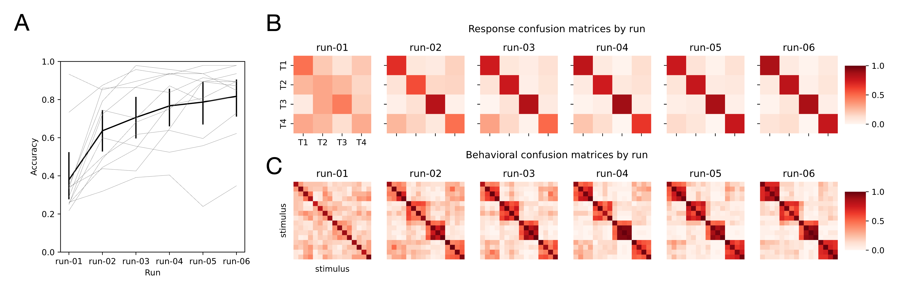

::: aside
Sitek et al. (submitted)
:::
::: {.notes}
Speaker notes go here.
:::

## Auditory categorization in the human brain

::: {layout-ncol=3 layout-valign="bottom"}
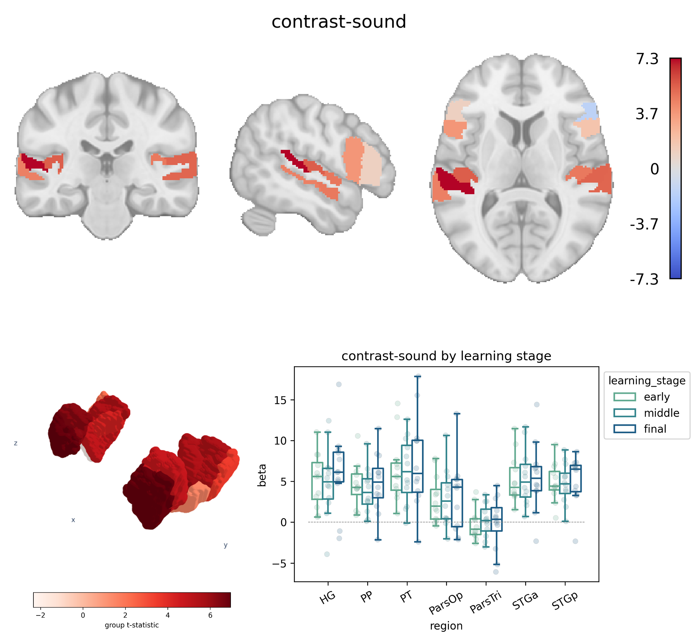{height="600" .fragment}

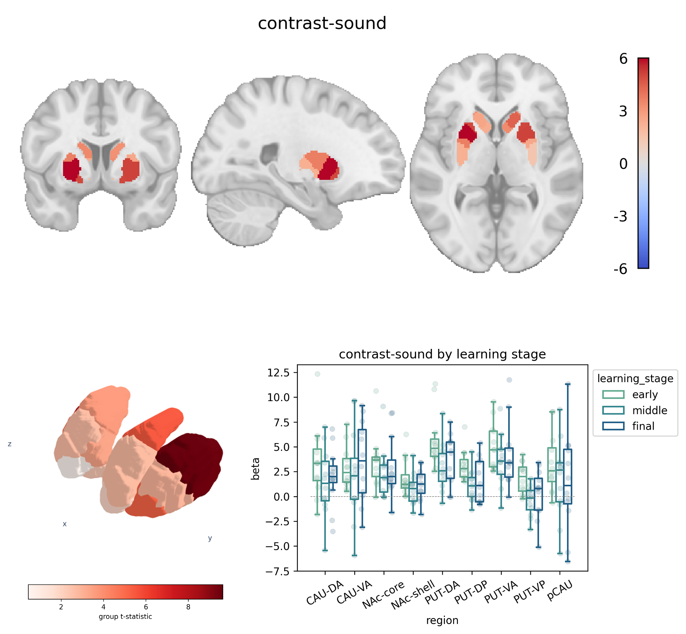{height="600" .fragment}

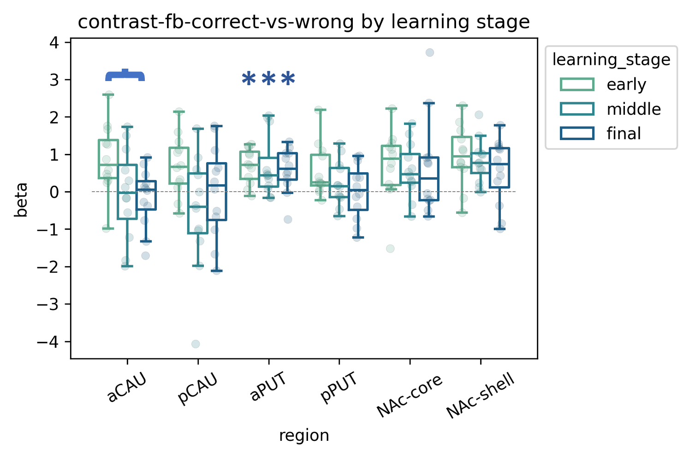{ .fragment}
:::

::: aside
Sitek et al. (submitted)
:::

::: {.notes}
Sound responses: everything significant except for PUT-VP and ParsTri
:::

## Finger motor representation in the human brain {.smaller}

::: {layout-ncol=3 .fragment}
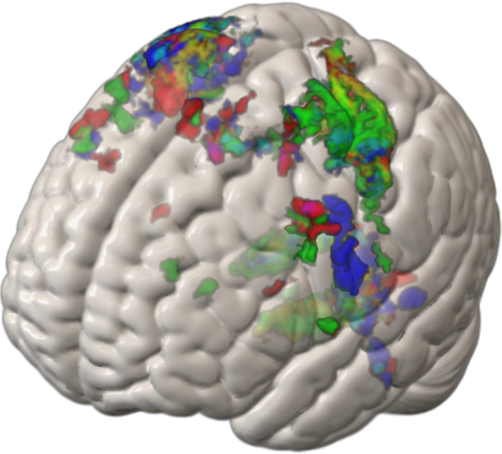

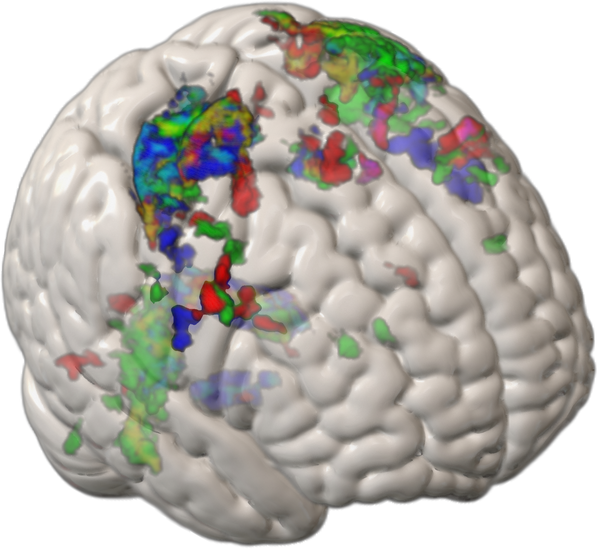

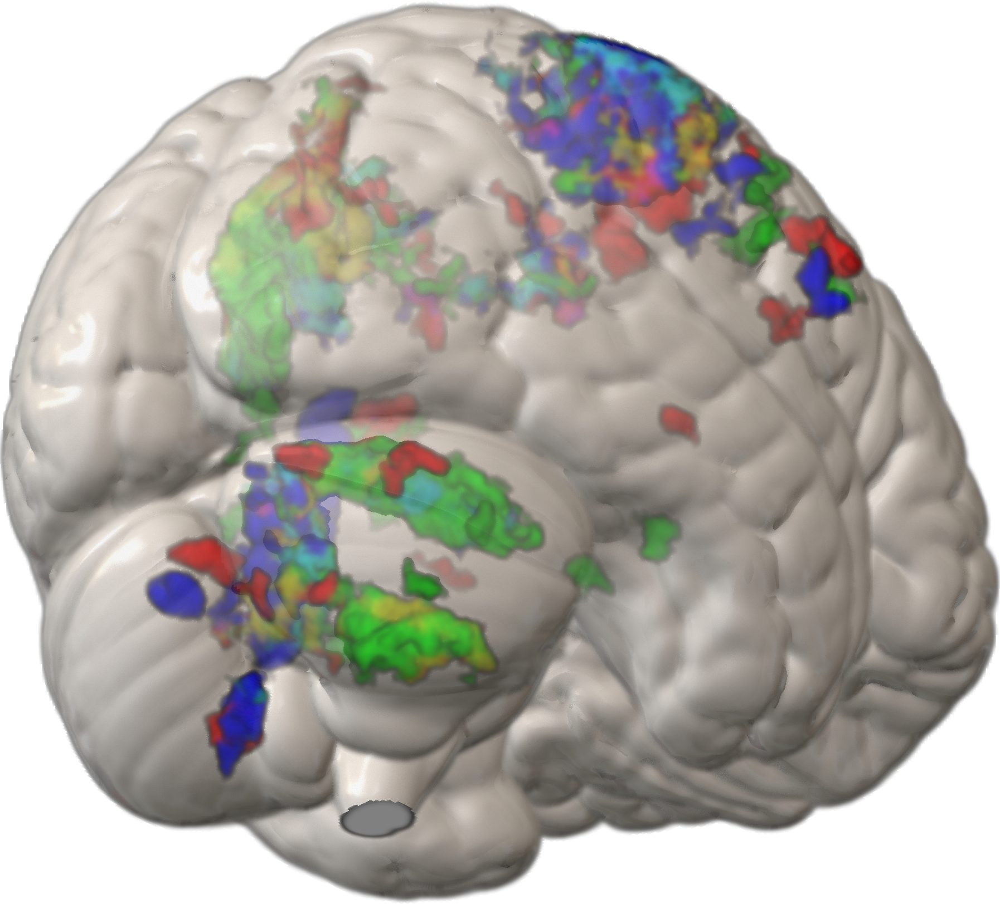
:::

Posterior mean dominance greater than 25% across voxels for the [right index  (red)]{style="color:red;"}, [left index (blue)]{style="color:blue;"}, and [middle fingers (green)]{style="color:green;"}. 

{.absolute bottom=10 right=10 width="200" height="200"}

::: aside
Moya et al. (in prep.)
:::

::: {.notes}
Moya et al.
Results for the fingertip mapping study:     
Fingertip dominance across the investigated regions. Posterior mean dominance greater than $25\%$ is shown across voxels for the right index finger (red), left index (blue), and middle fingers (green) based on the estimated partition structures and the estimated effect intensities.     
Colors blend when two or more fingers exhibit greater than $25\%$ dominance probabilities at the same location,     showing areas of competing dominance for the right index and either middle finger (yellow), left index and either middle finger (cyan), and the two index fingers (purple).
:::

## Auditory categorization in the human brain

::: {.incremental}
- Learning a new auditory categorization broadly activates striatum
- Feedback: 
  - **Anterior caudate** responds highest early on
  - **Anterior putamen** responds across learning stages
- We can use 7T fMRI to understand *fine-grained* striatal activity
:::
::: aside
Sitek et al. (submitted)
:::

::: {.notes}
Speaker notes go here.
:::

## The developing auditory system

#### How do we learn to hear in noisy environments?

::: {layout-ncol=2  layout-valign="bottom"}

::: {.incremental}

- Adults: maturation of speech network^[Du et al. (2014)] + compensatory networks^[Vaden et al. (2013); Eckert et al. (2016)]
- Children: fine-tuning speech network + undeveloped frontal networks
- Collected syllable-in-noise task fMRI at 3T in 35 typically developing kids 
  - 5 speech-shaped noise contexts: Quiet and SNR = +8, 0, -2, and -6
  - Task: identify which of 4 syllables were presented
:::

{fig-align="center"}

:::

::: aside
Sitek et al. (in prep.; SNL 2025)
:::

::: {.notes}
SSP
:::

## The developing auditory system: Speech-in-quiet vs. baseline

{fig-align="center" .fragment}

::: aside
Sitek et al. (in prep.; SNL 2025)
:::

::: {.notes}
SSP
:::

## The developing auditory system: Speech-in-quiet vs. -6 dB SNR

{fig-align="center" .fragment}

::: aside
Sitek et al. (in prep.; SNL 2025)
:::

::: {.notes}
SSP
:::

## Systems for speech-in-noise processing are actively developing in adolescents

::: {layout="[40,60]"   layout-valign="bottom"}
::: {.incremental}
- Children more strongly activate broad canonical auditory and language regions in clear speech compared to noisy stimuli
- No evidence that they utilize compensatory motor and prefrontal regions seen in adults
- Investigating task-relevant *representations* in development
- Currently collecting data in children with speech and language disorders
:::

{fig-align="center"}
:::

::: aside
Sitek et al. (in prep.; SNL 2025); 

Hampton-Wray R01DC019904
:::

::: {.notes}
SSP
:::

# Wrapping up

::: {.notes}
Speaker notes go here.
:::

## Non-invasively investigating the human auditory brainstem

::: {.incremental}

- Mapping the human subcortical auditory system
- Auditory–motor interactions across the auditory pathway
- Auditory categorization in the human brain
- Communication in practice: Sharing our science

::: 

::: {.notes}
Speaker notes go here.
:::

## Acknowledgments {.smaller}

:::: {.columns}

::: {.column width="50%"}

#### SoundBrain Lab
*especially:*

- Bharath Chandrasekaran
- Nike Gnanateja (now UW Madison)
- Casey Roark (now U New Hampshire)
- Jacie McHaney
- Kailyn McFarlane

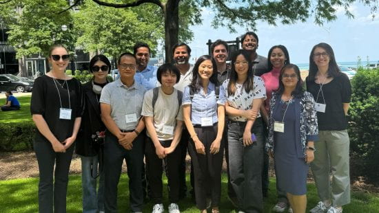

:::

::: {.column width=50%"}
**Northwestern**: Molly Bright, Michelle Medina (*BME PhD student*)

**UT Austin collaborators**: Abhra Sarkar, Noirrit Chandra (*now UT Dallas Statistics*), Blake Moya (*now in industry*)

**Pitt**: Jay Bohland, Mandy Hampton Wray, Tamer Ibrahim (*K01 co-mentor*)

#### Active funding and support
- K01 DC019421 (2023–2027)
- R21 DC022906 (2025–2028)
- R01 DC020963 (2024–2027; PI: Bohland)

{fig-align="center" height=100}
:::

::::

::: {.notes}
Speaker notes go here.
:::

# Thank you!

#

# Future directions

::: {.notes}
Speaker notes go here.
:::

## Future directions: Hearing loss

:::: {.columns}

::: {.column width="50%"}

### Speech-in-noise difficulties in middle age 
*put an image here!*

:::

::: {.column width=50%"}
### Neural predictors of cochlear implant success
*put an image here!*
:::

::::

::: aside
:::

::: {.notes}
:::

## Future directions: Analysis methods

:::: {.columns}

::: {.column width="50%"}

### `ffrprep`
*put an image here!*

:::

::: {.column width=50%"}
### Ex 2
*put an image here!*
:::

::::

::: aside
:::

::: {.notes}
:::

# Communication in practice: Sharing our science

::: {.notes}
Speaker notes go here.
:::

## Science is not a silo

:::: {.columns}

::: {.column width="50%"}

Communicating our science:

- builds community
- strengthens impact
- increases resilience
:::

::: {.column width=50%"}
*put an image here!*
:::

::::

::: aside
Sitek et al. (2025 *Aperture Neuro*); 
Wearn, Sitek, et al. (2025 *Aperture Neuro*)
:::

::: {.notes}
Sitek et al. (2025 *Aperture Neuro*); 
Wearn, Sitek, et al. (2025 *Aperture Neuro*)
:::

